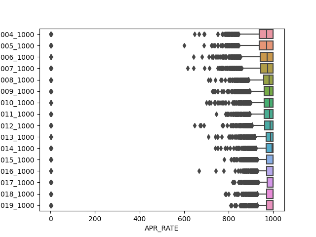
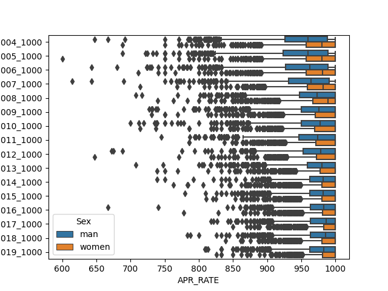
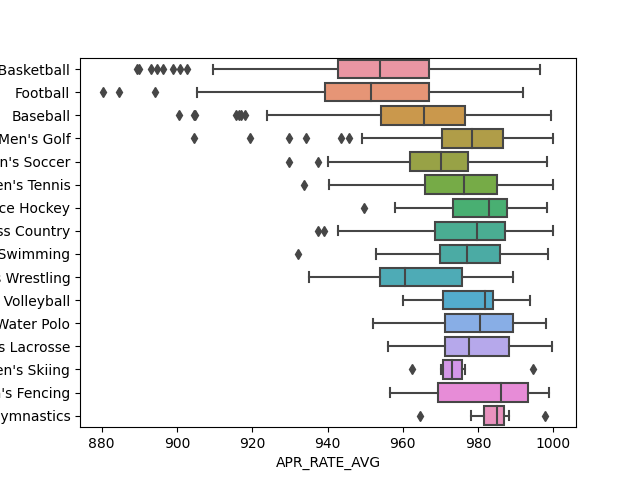
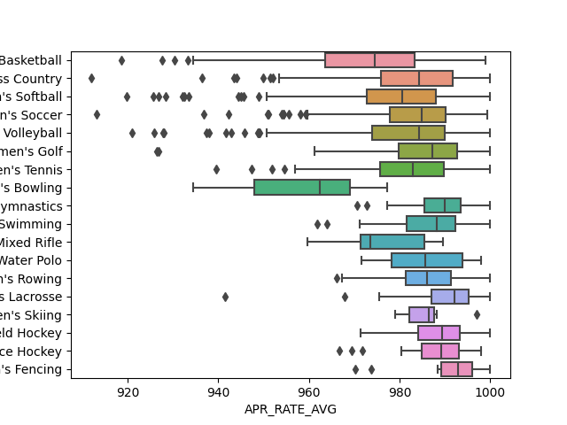

# hw-ncaa

* [NCAA student-athlete academic performance APR](https://www.ncaa.org/about/resources/research/shared-ncaa-research-data). 
  * This page has links to data and documentation for the NCAA Academic Progress Rates (APRs) of student-athletes. 
  * As of January 2023, the CSV for 2004-2019 was last updated in May 2020.
* Each questions is worth 2.5 points.
* Recommendations:
  * It's easiest to solve the entire assignment after first organizing the data into a long form (tidy) data structure as described in the [Seaborn documentation](https://seaborn.pydata.org/tutorial/data_structure.html). 
  * Consider using the [pandas.melt()](https://pandas.pydata.org/docs/reference/api/pandas.melt.html) method
  * You can answer Questions 1-3 by visualizing distributions with boxplots.
  * You can answer Questions 1 & 2 with one call (each) to seaborn. Question 3 may require 2.
  * Each questions is worth 2.5 points.
  * Although boxplots will serve the purpose of the assignment, you may find that another visualization tells the story particularly well. Feel free to use another approach if you like, just make sure to justify your choice. This is a rich dataset. Extra credit for creative EDA that extends beyond the requirements of the assignment.
* Use [git-intro](https://github.com/ds5110/git-intro) as guidance for organizing your repo

## Question 0

Implement the DRY principle by putting all your preprocessing into one or more functions that get 
used by each question below.
Each question can be answered with one call to seaborn (except for the the last question, which can involve 2 calls).
Each question should be answered with one file.

## Question 1

Visualize the evolution of APR distributions over time. Comment on the major finding(s).
The box graph shows that the box height decreases with the increase of the year, which means that the data tends to be stable, that is, the fluctuation decreases.
The abnormal value is usually located on one side. When the year gets larger, the median deviates from the center of the upper and lower quartiles, and the median tends to the side of the maximum value, and the distribution skewness becomes stronger.
The outliers become sparse with the increase of years, and the degree of deviation from the lower quartile becomes smaller.

```
make q1
```



#The box graph shows that the box height decreases with the increase of the year, which means that the data tends to be stable, that is, the fluctuation decreases.

#The abnormal value is usually located on one side. When the year gets larger, the median deviates from the center of the upper and lower quartiles, and the median tends to the side of the maximum value, and the distribution skewness becomes stronger.

#The outliers become sparse with the increase of years, and the degree of deviation from the lower quartile becomes smaller.

## Question 2

Create a single visualization that compares evolution of APR distributions for men’s and women’s sports. Comment on the major finding(s).
As shown in the box diagram, women's APR_ RATE is higher than men as a whole.
Women's APR_ RATE box has lower height and less fluctuation.
The distance between the minimum value and the maximum value for men is larger, and the range of change is larger.

```
make q2
```



#As shown in the box diagram, women's APR_ RATE is higher than men as a whole.

#Women's APR_ RATE box has lower height and less fluctuation.

#The distance between the minimum value and the maximum value for men is larger, and the range of change is larger.

# Question 3

Compare APRs for individual sports, with one visualization for Men's and another for Women's.
Comment on the major finding(s).
The APR of Women's Lacrosse is high, the APR of Women's Bowling is low.
The APR of Men's Gymnastics and Men's Skiing fluctuates slightly, while the APR of Men's Basketball and Football fluctuates greatly.

```
make q3
```




#The APR of Women's Lacrosse is high, the APR of Women's Bowling is low.

#The APR of Men's Gymnastics and Men's Skiing fluctuates slightly, while the APR of Men's Basketball fluctuates greatly.

#Men's Basketball and Football APR are low because competition in these two areas is fierce, athletes have to put more time in training rather than study to maintain their D1 positions.
