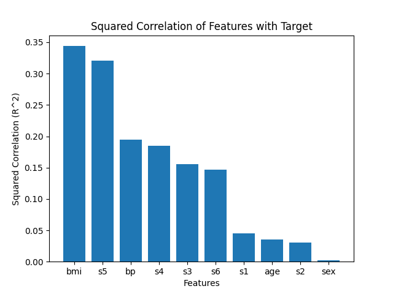
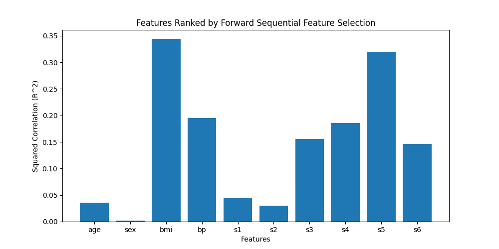
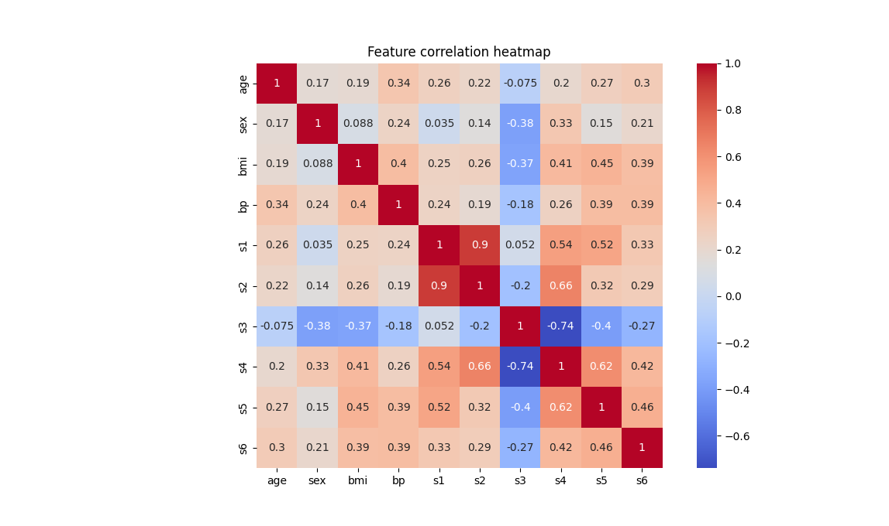
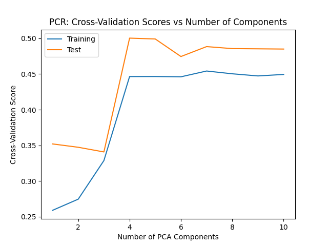
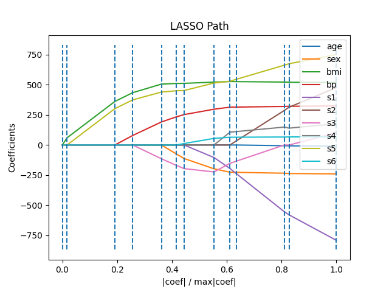

# hw-diabetes

## Goals

* Model-selection techniques using the diabetes dataset
* Comparison of feature ranking with $R^2$, forward selection and Lasso
* PCR (principal component regression) with cross validation to assess feature dimension

## Assignment

Use the diabetes dataset from [sklearn.datasets.load_diabetes](https://scikit-learn.org/stable/modules/generated/sklearn.datasets.load_diabetes.html) to answer the questions below.

## Question 1

Rank the features according to their squared correlation with the target. 
Note that squared correlation is the same as $R^2$ for univariate regression. 
Visualize the ordered scores with a bar chart.

```
make q1
```



## Question 2

Rank the features according to the order that they're added in the [forward sequential feature selection](https://scikit-learn.org/stable/modules/generated/sklearn.feature_selection.SequentialFeatureSelector.html) algorithm. Use this ranking to reorder the bar chart in question 1.

```
make q2
```



## Question 3

Compare the bar charts in Questions 1 & 2.
Briefly discuss differences between the two charts and possible causes.
Add a figure to prove your point.

```
make q3
```



### Comment
The differences in the charts can be attributed to the fact that the forward sequential feature selection algorithm takes into account the interaction between features, some features may have strong interactions with others, which are not captured in the univariate R^2 analysis. While the squared correlation method only considers the individual relationship of each feature with the target.

## Question 4

Plot cross-validation scores versus the number of components used in Principal Component Regression (PCR). 
(Recall the [PCR vs PLS](https://scikit-learn.org/stable/auto_examples/cross_decomposition/plot_pcr_vs_pls.html)
demo mentioned in class.)
Include both training and test scores.
Comment on the dimensionality of the dataset and the degree of overfitting.
Hint: The [CV-diabetes demo](https://scikit-learn.org/stable/auto_examples/exercises/plot_cv_diabetes.html),
which uses cross-validation to determine the best `alpha`, may be helpful in answering this question.

```
make q4
```



### Comment
The optimal number of components to use for PCR is 4, it's also the dataset's intrinsic dimensionality.  
The training and test scores converge and remain stable after the number of components more than 5, it indicates that the model has reached an optimal level of complexity and generalization.

## Question 5

The [lasso lars demo](https://scikit-learn.org/stable/auto_examples/linear_model/plot_lasso_lars.html) computes and plots the coefficients with lasso. Add a legend to the plot so that you can relate colors to feature names. Briefly compare the lasso ordering to your answers above.

```
make q5
```



### Comment

Lasso demonstrates the LASSO path's coefficient values for each feature as the regularization parameter changes. The plot displays how the coefficients of each feature change as the regularization strength (represented by the x-axis) varies.  
bmi and s5 have coefficients even the regulization strength is lower than 0.2.
Compares with individual squared correlation ordering, sex's rank increased a lot. It shows that though sex doesn't have a high influence individually, but it has corelation with high rank features.  
But the rank of LASSO and Foward Selection are not exactly the same.
