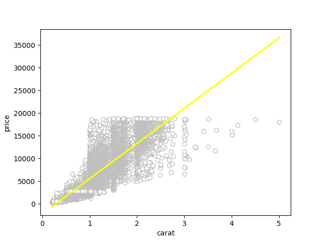
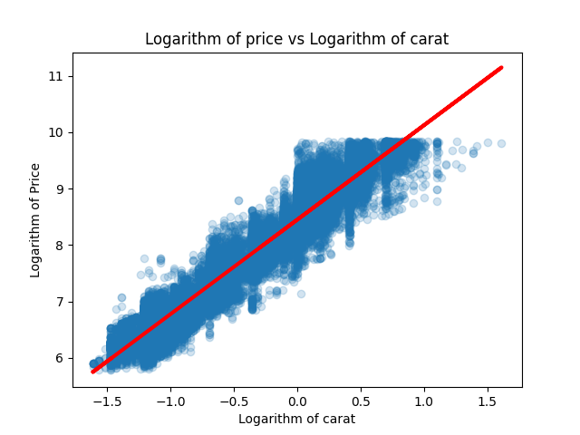
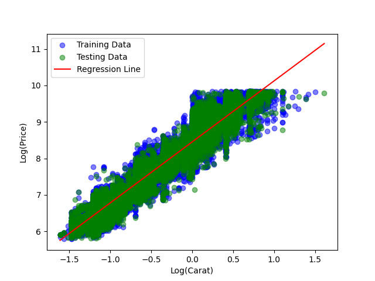
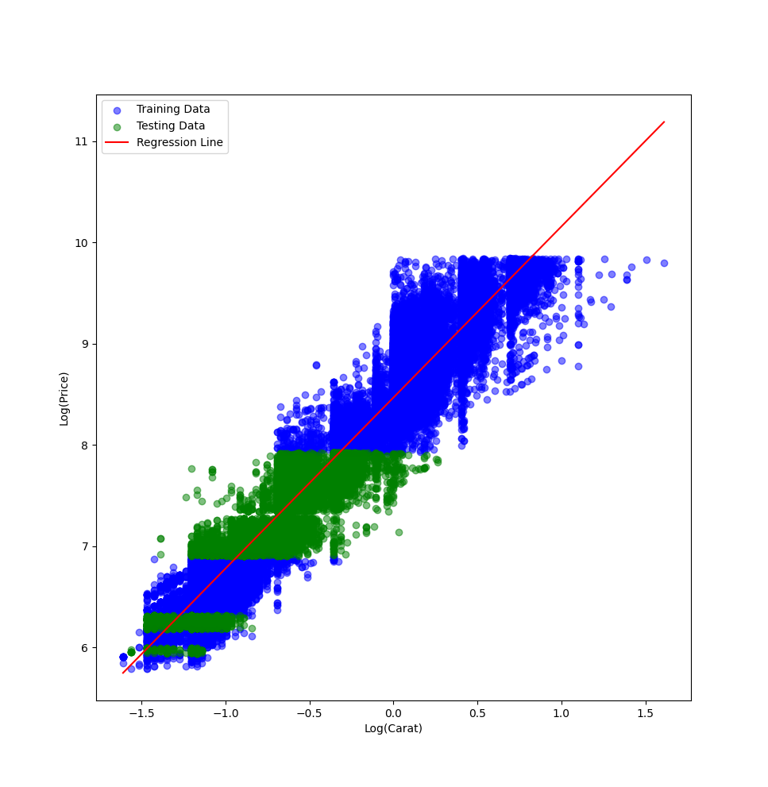
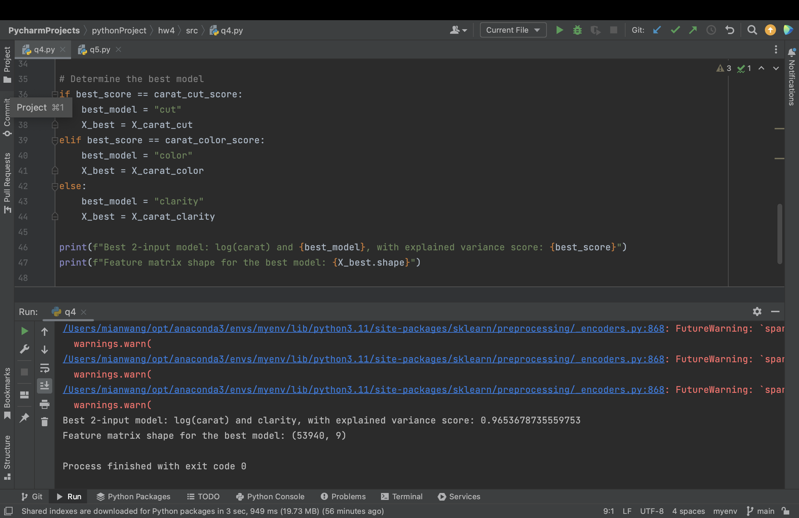
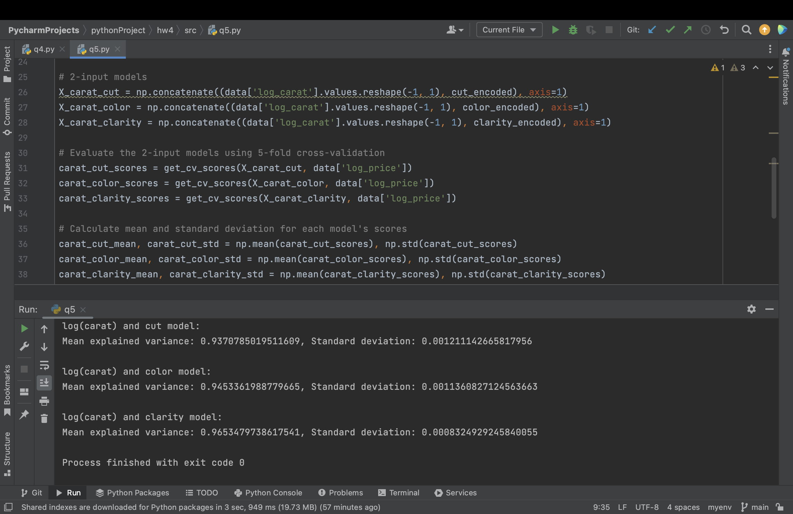

# hw-diamonds solution

## Assignment

Use the [diamonds dataset](https://ggplot2.tidyverse.org/reference/diamonds.html) to answer the questions below.
You can get the data directly from the [ggplot2 github repo](https://github.com/tidyverse/ggplot2/).

## Question 1

Visualize the relationship between "price" and "carat" and comment on the type of model that 
might be appropriate for modeling their relationship.

```
make q1
```



### Comment

There is a positive relationship between "price" and "carat" - as the carat weight of a diamond increases, so does its price. However, the relationship is not perfectly linear, as there is quite a bit of scatter in the plot. This suggests that a linear regression model might not be the best fit for this data. Instead, a linear model whose data undergo logarithmic transformations could be appropriate.

## Question 2

Investigate logarithmic transformations to see if you can find a more appropriate relationship
between "price" and "carat" for univariate linear regression.
Use data visualization to help justify your choice of model.
Use explained variance as a metric for model performance, and report training scores based on the entire dataset.

```
make q2
```



```
make q2_training score
```


### Comment

After logarithmic transformations, the relationship is more accurate.
The training score is 0.933

## Question 3

Use the `simple_train_test_split` function below and `sklearn.model_selection.train_test_split` 
to evaluate the explained variance of the univariate model using the testing dataset.
Use explained variance as a metric for model performance.
Describe the results and create a visualization that helps explain the differences between the two approaches.
```
def simple_train_test_split(X, y, test_size=.3):
    n_training_samples = int((1.0 - test_size) * X.shape[0])

    X_train = X[:n_training_samples,:]
    y_train = y[:n_training_samples]

    X_test = X[n_training_samples:,:]
    y_test = y[n_training_samples:]

    return X_train, X_test, y_train, y_test
```

When choosing training data randomly
```
make q3
```



```
make score
```


When choosing training data according to its sequence in the csv file
```
make q3
```



```
make score
```


### Comment

The first result is created by choosing training data randomly, so the score is high. The second approach is choosing the training data according to the sequence in csv file, the testing data is in the last 30% data, as we can see in the image, they basicly in two small areas of the whole distribution, so the score is low.
The training data should be selected based on the principle of independent and identical distribution, and should be sampled evenly to prevent over-fitting.


## Question 4

Use one-hot encoding to find the best 2-input model by adding either "cut", "color" or "clarity" as a second predictor along with "log(carat)" to model "log(price)". Which 2-input model has the best performance? Report the training score
with explained variance metric, using the entire dataset for both training and evaluation. Compare to the corresponding univariate model in question 2. What's the ".shape" of the feature matrix for the "best" model?

```
make q4
```



### Comment

Log(carat) with "clarity" has the best performance.  
The score is significantly increased by adding "clarity" as the second predictor. ".shape" is the dimensionality of the model, since clarity has nine categories, the model's recognition of the dataset is improved and the entropy value of the dataset is reduced by this model.

## Question 5

Repeat the analysis of Question 4, this time using 5-fold cross validation.
Report both train and test scores (average +/- standard deviation).
Compare results here with those of Question 4.
Discuss results and explain any significant differences with Question 4.

```
make q5
```




### Comment

Comparing these results with the Question 4, the mean explained variance scores are slightly lower than the training scores obtained when using the entire dataset for training and evaluation. This is expected, as cross-validation provides a more reliable estimate of the model's performance on unseen data by averaging the scores over multiple splits of the data.

The standard deviation of the explained variance scores gives an idea of the variability in the model's performance across different splits of the data. 
